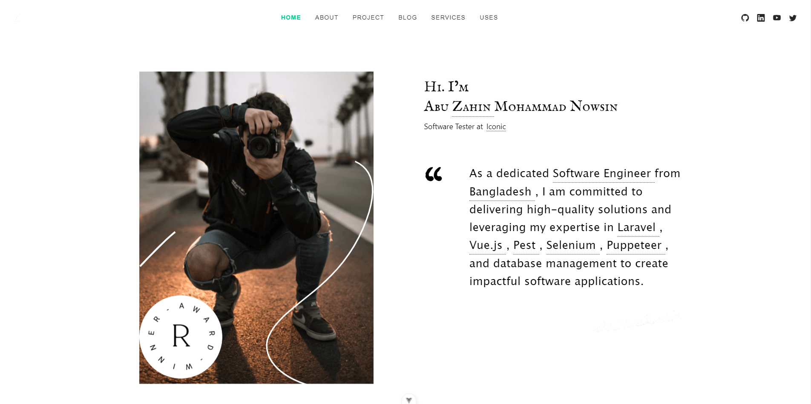
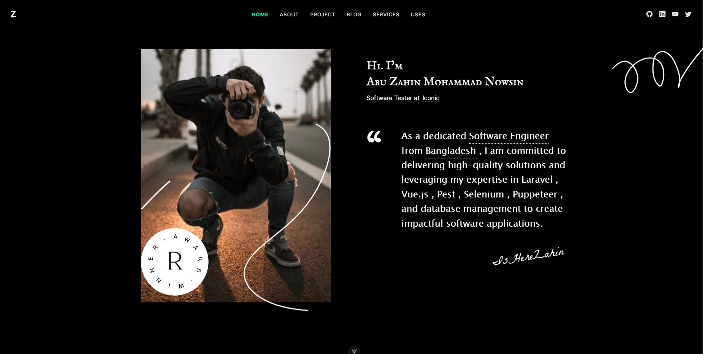
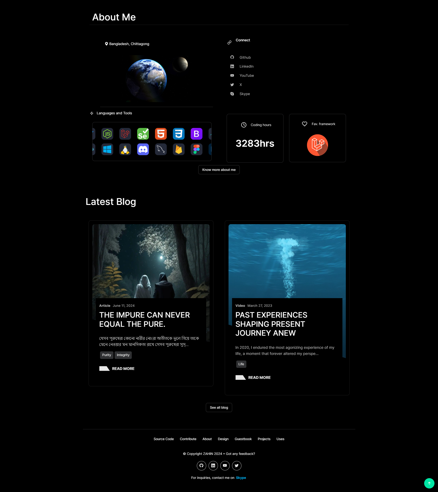
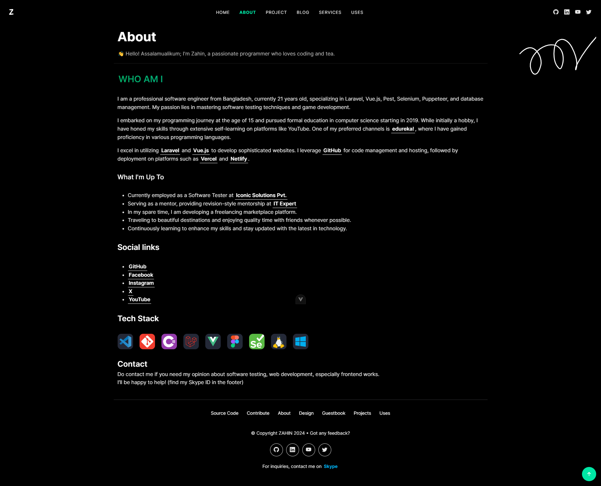
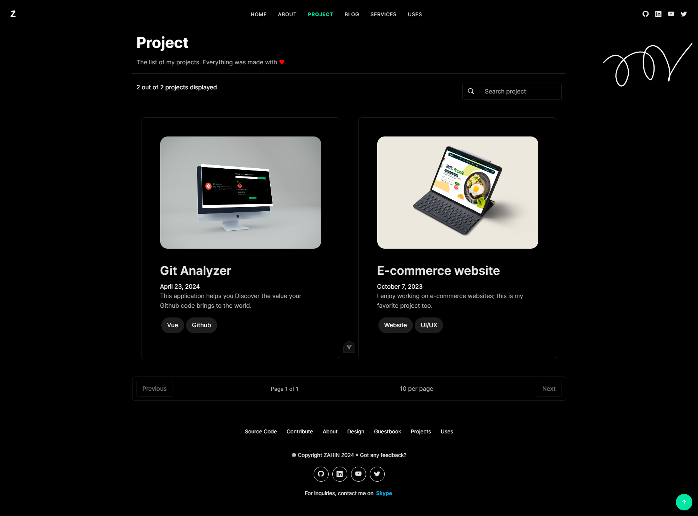
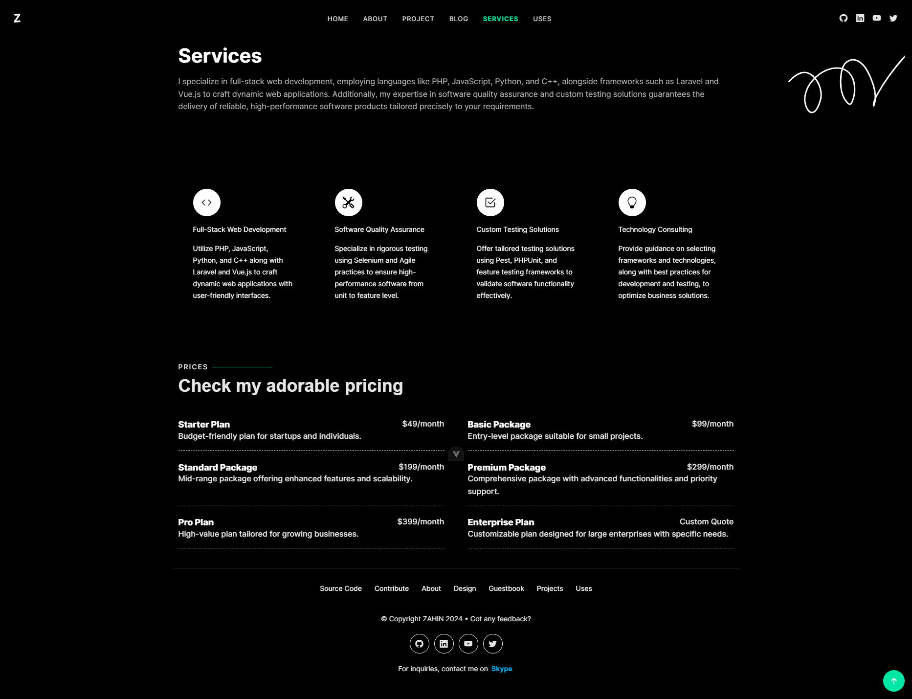

# Portfolio Website

Welcome to my personal portfolio website repository! This project showcases my skills, projects, and experience in software engineering and web development. The website is built using Vue.js and features a responsive design, dark-light mode, and various sections highlighting my work and services.




## Features

- **Responsive Design:** Ensures optimal viewing on all devices.
- **Dark-Light Mode:** Toggle between dark and light themes.
- **About Section:** Learn about my background and career journey.
- **Project Section:** Explore detailed descriptions of my featured projects.
- **Blog Section:** Stay updated with my latest articles and insights.
- **Design Section:** Showcase of my UI/UX design portfolio.
- **Services Section:** Discover the services I offer, including web development and design consultation.

## Screenshots


1. 
   This screenshot shows the homepage of my portfolio website, featuring a clean and modern design with a hero section highlighting key projects and services.

2. 
   This screenshot displays the about page, providing insights into my background, skills, and professional journey in software engineering.

3. 
   This screenshot showcases the project section, where visitors can explore detailed descriptions, images, and technologies used for each of my featured projects.

4. 
   This screenshot highlights the services page, outlining the various services I offer, including web development, UI/UX design, and consulting.


## Getting Started

To get a local copy up and running, follow these simple steps:

1. Clone the repository:
   ```sh
   git clone https://github.com/IsHereZahin/isherezahin.me.git

2. Navigate into the project directory::
   ```sh
   cd isherezahin.me

3. Install dependencies:
   ```sh
   npm install

4. Start the development server:
   ```sh
   npm run dev

## Contributing
Contributions are welcome! There are several ways you can contribute to this project:

- Report bugs and issues.
- Suggest new features or improvements.
- Submit pull requests to address issues or add features.

Before contributing, please read [Contributing Guide](./CONTRIBUTING.md) to learn about our development process, coding standards, and how to set up your environment.
